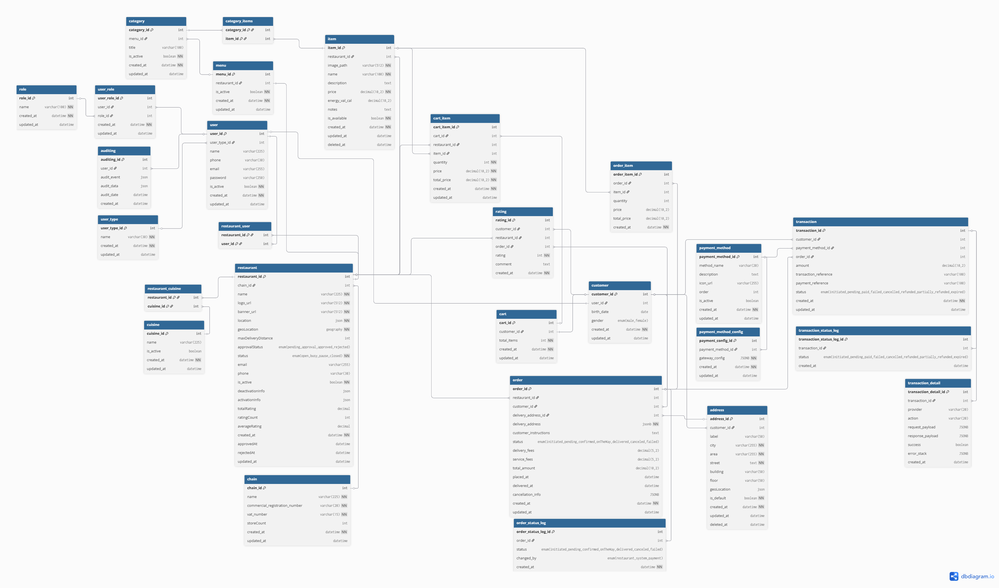

# Food Delivery App

A scalable and modular backend application for a food delivery service, built with **Node.js**, **Express**, **TypeScript**, and **TypeORM**. The app includes features like user management, rate limiting, logging, and database integration.

---

## Features

- **Express Framework**: Fast and lightweight web server.
- **TypeScript**: Strongly typed language for better code quality.
- **TypeORM**: Database ORM for managing entities and migrations.
- **Winston Logging**: Centralized logging to console and files.
- **Rate Limiting**: Protects APIs from abuse using `express-rate-limit`.
- **Redis Integration**: Caching and session management.
- **Helmet**: Security headers for better protection.
- **Docker Support**: Containerized deployment with `Docker` and `docker-compose`.
- **Environment Configuration**: Managed using `.env` files and validated with `Joi`.

---

# Project documentation

## Prerequisites

- **Node.js**: v20.18.1 or higher
- **Docker**: Installed for containerized deployment
- **PostgreSQL**: Database for storing application data
- **Redis**: For caching and rate limiting

## Installation

1. Clone the repository:

```bash
git clone https://github.com/your-repo/FoodDeliveryApp.git

cd FoodDeliveryApp
```

2. Install dependencies:

```bash
 npm install
```

3. Set up environment variables:

Copy the appropriate .env file from the env/ directory (e.g., _development.env_) and configure it as needed.

4. Build the project:

```bash
npm run build
```

5. Start the server:

```bash
npm run start
```

## Development

1. Start the development server with hot-reloading:

```bash
npm run dev
```

2. Run linting and formatting:

```bash
npm run lint
npm run format
```

3. Run tests:

```bash
 npm test
```

## Docker Deployment

1. Build and run the application using Docker Compose

```bash
docker-compose -f docker-compose.yaml -f docker-compose.dev.yaml up --build
```

2. For production:

```bash
docker-compose -f docker-compose.yaml -f docker-compose.prod.yaml up --build
```

---

## Logging

Logs are managed using Winston and stored in the **logs/** directory.
Console logs are colorized for better readability in development.

## Rate Limiting

Default rate limit: **100 requests per 5 minutes per IP**.
Configured using _express-rate-limit_ with Redis for persistence.

## Environment Variables

| Variable          | Description                        | Default Value |
| ----------------- | ---------------------------------- | ------------- |
| NODE_ENV          | Application environment            | development   |
| PORT              | Server port                        | 4000          |
| DATABASE_HOST     | Database host                      | localhost     |
| DATABASE_PORT     | Database port                      | 5432          |
| DATABASE_USERNAME | Database username                  | postgres      |
| DATABASE_PASSWORD | Database password                  | postgres      |
| DATABASE_NAME     | Database name                      | food_delivery |
| REDIS_HOST        | Redis host                         | localhost     |
| REDIS_PORT        | Redis port                         | 6379          |
| REDIS_DEFAULT_TTL | Redis default ttl time for caching | 3600          |

## Data Model


## License

This project is licensed under the MIT License. See the LICENSE file for details.

## Resource and Documentation

- [Joi](https://joi.dev/api/?v=17.13.3)
- [Typeorm](https://typeorm.io/)
- [winston](https://github.com/winstonjs/winston#readme)
- [ioredis](https://redis.io/docs/latest/develop/data-types/)
