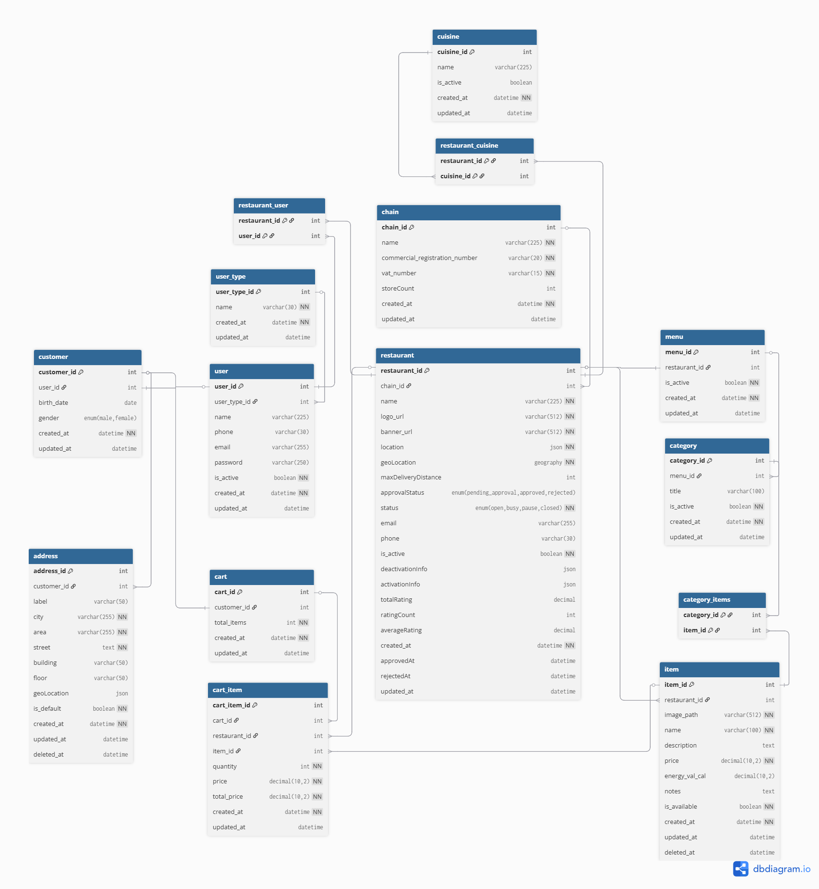

# Manage Cart – Use Case Documentation

This repository contains a comprehensive documentation for the Simple **Manage Cart** use case of a food delivery application. It includes the complete flow description, visual representations, data modeling, and supporting SQL scripts.

---

## Content List

1. [Overview](#overview)
2. [Manage Cart Use Case Flows](#manage-cart-use-case-flows)
3. [Flowchart Diagram](#flowchart-diagram)
4. [Sequence Diagram](#sequence-diagram)
5. [Entity Relationship Diagram (ERD)](#entity-relationship-diagram-erd)
6. [Data Model Description](#data-model-description)
7. [Database Schema (PostgreSQL Compatible)](#database-schema-postgresql-compatible)

---

## Overview

The **Manage Cart** use case enables customers of the food delivery application to manage the contents of their shopping cart. This functionality is crucial as it allows users to:

- Add menu items from a selected restaurant
- Customize and update their item selections
- Remove individual items or clear the entire cart
- Add special instructions for each item
- Review the total price dynamically
- Save the cart to proceed to checkout later

This documentation aims to present the full flow and underlying structure of the Manage Cart use case, including business logic, interaction diagrams, data storage schema, and implementation-ready SQL scripts.

---

## Manage Cart Use Case Flows

### `Actors`  
- Customer

### `Main Flow: Manage Cart` 

**Goal**:  
The customer can add, update, and remove items in their shopping cart before placing an order.

**Precondition**:

- The customer is authenticated in the application using their user account.  
- The restaurant is subscribed to the app, and its menu is available.

**Flow Steps**:

1. The customer opens the application, and the system assigns a delivery address either automatically (via location detection) or manually (via map).
2. If not authenticated, the customer is directed to register/login using their user account and verifies it via OTP.
3. Once authenticated or browsing as a guest, the customer views a list of restaurants based on their selected location.
4. The customer selects a restaurant and browses its menu.
5. The customer selects items and customizes them (e.g., size, toppings, notes).
6. The customer adds the customized items to the cart.
7. The system confirms the item has been added and updates the cart icon/badge with the total number of items.
8. The customer can open the cart to review current selections.
9. Inside the cart:
   - The customer can update the quantity of each item.
   - The customer can remove items from the cart.
   - The customer can add special notes or instructions for the restaurant.
10. The system updates the cart total dynamically as changes are made.
11. The customer can clear the cart entirely if desired.
12. The customer can save the cart (if supported) to continue shopping later.
13. If the customer is ready, they can proceed to checkout (this leads into the “Place New Order” use case).

**Postcondition**:  
- The cart is saved in the system with all updated items and notes, ready for checkout or further modification.

---

## Flowchart Diagram


---

## Sequence Diagram


---

## Entity Relationship Diagram (ERD)



---

## Data Model Description

The data model for the **Manage Cart** use case includes core entities such as users, customers, restaurants, menu, categories, items, and the cart itself. The following tables are used to support the cart operations:


### `user_type`
Defines the roles of users in the system.

- `user_type_id` (PK)
- `name` – Unique role name (e.g., "customer")
- `created_at`, `updated_at`


### `user`
Stores account details for users, including login credentials and contact information.

- `user_id` (PK)
- `user_type_id` – Foreign key to `user_type`
- `name`, `phone`, `email`, `password`
- `is_active`, `created_at`, `updated_at`


### `customer`
Links the user to a customer profile, including optional personal data.

- `customer_id` (PK)
- `user_id` – Foreign key to `user`
- `birth_date`, `gender`
- `created_at`, `updated_at`


### `address`
Manages customer addresses. A customer may have multiple addresses with one marked as default.

- `address_id` (PK)
- `customer_id` – Foreign key to `customer`
- `label` – Address label (e.g., "Home", "Work")
- `city`, `area`, `street`, `building`, `floor`
- `geoLocation` (JSON)
- `is_default` – Indicates default delivery address
- `created_at`, `updated_at`, `deleted_at`
  

### `chain`
Stores chain registration and profile details. Each restaurant can be linked to a chain.

- `chain_id` (PK)
- `name` – Unique chain name
- `commercial_registration_number` – Unique commercial registration number
- `vat_number` – Unique VAT number
- `storeCount` – Number of stores in the chain
- `created_at`, `updated_at`


### `cuisine` & `restaurant_cuisine`
Stores cuisine details. Each restaurant can have multiple cuisines.

- `cuisine_id` (PK)
- `name` – Unique cuisine name
- `is_active` – Indicates if the cuisine is active
- `created_at`, `updated_at`

- `restaurant_cuisine`: Composite table linking `restaurant_id` with `cuisine_id`


### `restaurant`
Stores restaurant registration and profile details.

- `restaurant_id` (PK)
- `chain_id` – Foreign key to `chain`
- `name`,`email`, `phone`
- `logo_url`, `banner_url`
- `location` (contains location details)
- `geoLocation` (geography coordinates) 
- `maxDeliveryDistance` – Maximum delivery distance in kilometers
- `approvalStatus` (enum: pending_approval, approved, rejected)
- `status` (enum: open, busy, pause, closed)
- `is_active`
- `deactivationInfo` (contains deactivated_by, deactivation_reason, deactivated_at)
- `activationInfo` (contains activated_by, activation_reason, activated_at)
- `totalRating` , `ratingCount` ,`averageRating`
- `created_at`, `updated_at`
- `approvedAt`, `rejectedAt`
  

### `restaurant_user`
Stores the relationship between restaurants and users.

- `restaurant_id` (PK)
- `user_id` (PK)


### `menu`
Defines menu for restaurants. Each restaurant can have one menu.

- `menu_id` (PK)
- `restaurant_id` – Foreign key to `restaurant`
- `is_active`
- `created_at`, `updated_at`


### `category`
Defines categories for menu. menu can have multiple categories.

- `category_id` (PK)
- `menu_id` (Foreign key to `menu`)
- `title`
- `is_active`
- `created_at`, `updated_at`


### `item` and `category_items`
Defines items with pricing and availability.

- `item_id` (PK)
- `restaurant_id` – Foreign key to `restaurant`
- `image_path`, `name`, `description`, `price`, `energy_val_cal`, `notes`
- `is_available`
- `created_at`, `updated_at`

- `category_items`: Composite table linking `category_id` with `item_id`


### `cart`
Represents a customer’s cart.

- `cart_id` (PK)
- `customer_id` – Foreign key to `customer`
- `total_items`
- `created_at`, `updated_at`


### `cart_item`
Stores individual items within a cart along with pricing and quantity.

- `cart_item_id` (PK)
- `cart_id` – Foreign key to `cart`
- `restaurant_id` – Foreign key to `restaurant`
- `item_id` – Foreign key to `item`
- `quantity`, `price`, `total_price`
- `created_at`, `updated_at`

These entities together provide the full backend data structure for managing a customer's cart, supporting features such as adding/removing items, updating quantities, viewing total cost, and persisting cart state across sessions.

---

## Database Schema (PostgreSQL Compatible)

```sql
CREATE TABLE user_type (
    user_type_id SERIAL PRIMARY KEY,
    "name" VARCHAR(100) NOT NULL UNIQUE,
    created_at TIMESTAMP NOT NULL DEFAULT CURRENT_TIMESTAMP,
    updated_at TIMESTAMP DEFAULT CURRENT_TIMESTAMP
);

CREATE TABLE "user" (
    user_id SERIAL PRIMARY KEY,
    name VARCHAR(255) NOT NULL,
    email VARCHAR(255) NOT NULL UNIQUE,
    phone VARCHAR(30) UNIQUE,
    password VARCHAR(250) NOT NULL CHECK (CHAR_LENGTH(password) BETWEEN 8 AND 250),
    is_active BOOLEAN NOT NULL DEFAULT TRUE,
    user_type_id INT REFERENCES user_type(user_type_id) ON DELETE SET NULL,
    created_at TIMESTAMP NOT NULL DEFAULT CURRENT_TIMESTAMP,
    updated_at TIMESTAMP DEFAULT CURRENT_TIMESTAMP
);

CREATE TABLE address (
    address_id SERIAL PRIMARY KEY,
    customer_id INT NOT NULL REFERENCES customer(customer_id),
    label VARCHAR(50) NULL,
    city VARCHAR(255) NOT NULL,
    area VARCHAR(255) NOT NULL,
    street TEXT NOT NULL,
    building VARCHAR(50) NULL,
    floor VARCHAR(50) NULL,
    geoLocation geography(Point, 4326) NOT NULL,
    is_default BOOLEAN NOT NULL DEFAULT FALSE,
    created_at TIMESTAMP NOT NULL DEFAULT CURRENT_TIMESTAMP,
    updated_at TIMESTAMP DEFAULT CURRENT_TIMESTAMP,
    deleted_at TIMESTAMP DEFAULT NULL
);

CREATE TABLE customer (
    customer_id SERIAL PRIMARY KEY,
    user_id INT NOT NULL UNIQUE REFERENCES "user"(user_id),
    birth_date DATE NULL,
    gender VARCHAR(6) CHECK (gender IN ('male', 'female')),
    created_at TIMESTAMP NOT NULL DEFAULT CURRENT_TIMESTAMP,
    updated_at TIMESTAMP DEFAULT CURRENT_TIMESTAMP
);

CREATE TABLE chain (
    chain_id SERIAL PRIMARY KEY,
    "name" VARCHAR(255) NOT NULL,
    commercial_registration_number VARCHAR(20) UNIQUE NOT NULL,
    vat_number VARCHAR(15) UNIQUE NOT NULL,
    store_count INT DEFAULT 1,
    created_at TIMESTAMP NOT NULL DEFAULT CURRENT_TIMESTAMP,
    updated_at TIMESTAMP DEFAULT CURRENT_TIMESTAMP
);

CREATE TABLE cuisine (
    cuisine_id SERIAL PRIMARY KEY,
    "name" VARCHAR(255) NOT NULL,
    is_active BOOLEAN NOT NULL DEFAULT TRUE,
    created_at TIMESTAMP NOT NULL DEFAULT CURRENT_TIMESTAMP,
    updated_at TIMESTAMP DEFAULT CURRENT_TIMESTAMP
);

CREATE TABLE restaurant (
    restaurant_id SERIAL PRIMARY KEY,
    chain_id INT NOT NULL UNIQUE REFERENCES "chain"(chain_id),
    "name" VARCHAR(255) NOT NULL,
    logo_url VARCHAR(512) DEFAULT '',
    banner_url VARCHAR(512) NOT NULL DEFAULT '',
    "location" JSONB NOT NULL,
    geoLocation GEOGRAPHY(POINT, 4326) NOT NULL,
    max_delivery_distance INT NOT NULL DEFAULT 5000,
    approval_status VARCHAR(6) NOT NULL CHECK (approval_status IN ('pending_approval', 'approved', 'rejected')),
    "status" VARCHAR(6) NOT NULL CHECK ("status" IN ('open', 'busy', 'pause', 'closed')),
    email VARCHAR(255) DEFAULT '',
    phone VARCHAR(30) DEFAULT '',
    is_active BOOLEAN NOT NULL DEFAULT TRUE,
    deactivation_info JSONB DEFAULT NULL,
    activation_info JSONB DEFAULT NULL,
    total_rating DECIMAL NOT NULL DEFAULT 0,
    rating_count INT NOT NULL DEFAULT 0,
    average_rating DECIMAL NOT NULL DEFAULT 0,
    created_at TIMESTAMP NOT NULL DEFAULT CURRENT_TIMESTAMP,
    approved_at TIMESTAMP DEFAULT NULL,
    rejected_at TIMESTAMP DEFAULT NULL,
    updated_at TIMESTAMP DEFAULT CURRENT_TIMESTAMP
);

CREATE TABLE restaurant_user (
    restaurant_id INT NOT NULL REFERENCES restaurant(restaurant_id),
    user_id INT NOT NULL REFERENCES user(user_id)
);

CREATE TABLE restaurant_cuisine (
    restaurant_id INT NOT NULL UNIQUE REFERENCES "restaurant"(restaurant_id),
    cuisine_id INT NOT NULL UNIQUE REFERENCES "cuisine"(cuisine_id)
);


CREATE TABLE menu (
    menu_id SERIAL PRIMARY KEY,
    restaurant_id INT NOT NULL UNIQUE REFERENCES restaurant(restaurant_id),
    is_active BOOLEAN NOT NULL DEFAULT TRUE,
    created_at TIMESTAMP NOT NULL DEFAULT CURRENT_TIMESTAMP,
    updated_at TIMESTAMP DEFAULT CURRENT_TIMESTAMP
);

CREATE TABLE category (
    category_id SERIAL PRIMARY KEY,
    menu_id INT NOT NULL UNIQUE REFERENCES menu(menu_id),
    title VARCHAR(100) NOT NULL UNIQUE CHECK (CHAR_LENGTH(title) BETWEEN 2 AND 100),
    is_active BOOLEAN NOT NULL DEFAULT TRUE,
    created_at TIMESTAMP NOT NULL DEFAULT CURRENT_TIMESTAMP,
    updated_at TIMESTAMP DEFAULT CURRENT_TIMESTAMP
);

CREATE TABLE category_items (
    category_id INT NOT NULL REFERENCES category(category_id),
    item_id INT NOT NULL REFERENCES item(item_id)
);

CREATE TABLE item (
    item_id SERIAL PRIMARY KEY,
    restaurant_id INT NOT NULL UNIQUE REFERENCES restaurant(restaurant_id),
    image_path VARCHAR(512) NOT NULL DEFAULT '',
    "name" VARCHAR(100) NOT NULL UNIQUE CHECK (CHAR_LENGTH("name") BETWEEN 2 AND 100),
    "description" TEXT DEFAULT '',
    price DECIMAL(10,2) NOT NULL CHECK (price >= 0.00),
    energy_val_cal DECIMAL(10,2) NOT NULL DEFAULT 0.0 CHECK (energy_val_cal >= 0.00),
    notes TEXT DEFAULT '',
    is_available BOOLEAN NOT NULL DEFAULT TRUE,
    created_at TIMESTAMP NOT NULL DEFAULT CURRENT_TIMESTAMP,
    updated_at TIMESTAMP DEFAULT CURRENT_TIMESTAMP,
    deleted_at TIMESTAMP DEFAULT NULL
);

CREATE TABLE cart (
    cart_id SERIAL PRIMARY KEY,
    customer_id INT NOT NULL REFERENCES customer(customer_id),
    created_at TIMESTAMP NOT NULL DEFAULT CURRENT_TIMESTAMP,
    updated_at TIMESTAMP DEFAULT CURRENT_TIMESTAMP
);

CREATE TABLE cart_item (
    cart_item_id SERIAL PRIMARY KEY,
    cart_id INT NOT NULL REFERENCES cart(cart_id),
    restaurant_id INT NOT NULL REFERENCES restaurant(restaurant_id),
    item_id INT NOT NULL REFERENCES item(item_id),
    price DECIMAL(10,2) NOT NULL CHECK (price >= 0.00),
    quantity INT NOT NULL CHECK (quantity > 0),
    total_price DECIMAL(10,2) NOT NULL CHECK (total_price >= 0.00),
    created_at TIMESTAMP NOT NULL DEFAULT CURRENT_TIMESTAMP,
    updated_at TIMESTAMP DEFAULT CURRENT_TIMESTAMP
);
