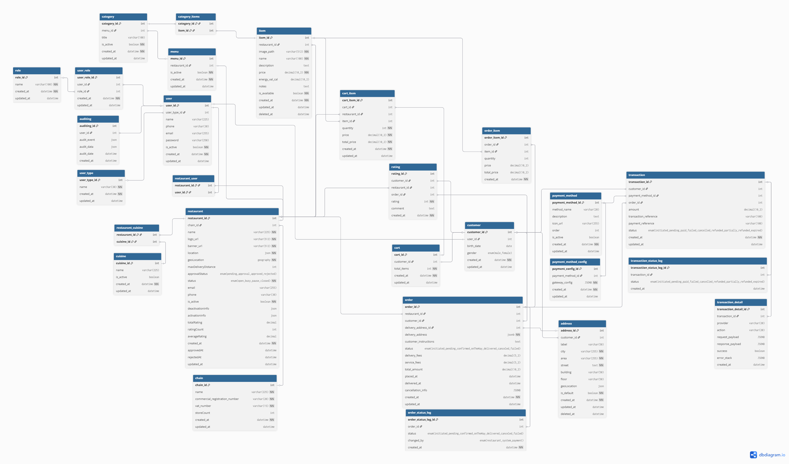

# Manage Order – Use Case Documentation

This repository contains comprehensive documentation for the **Place Order** use case of a food delivery application. It includes the complete flow description, visual representations, data modeling, and supporting pseudocode and diagrams.

---

## Content List

1. [Overview](#overview)
2. [Manage order Use Case Flows](#manage-order-use-case-flows) 
3. [Flowchart Diagram](#flowchart-diagram)
4. [Sequence Diagram](#sequence-diagram)
5. [Entity Relationship Diagram (ERD)](#entity-relationship-diagram-erd)
6. [Data Model Description](#data-model-description)
7. [Database Schema (PostgreSQL Compatible)](#database-schema-postgresql-compatible)

---

## Overview

The **Place Order** use case enables customers of the food delivery application to seamlessly complete the ordering process—from selecting a delivery location and items to completing payment and receiving their order. This use case is essential for ensuring a smooth, secure, and user-friendly experience. It includes the ability to:

- Detect or manually assign a delivery location  
- Browse and select restaurants and menu items  
- Apply customizations and review cart contents  
- Choose a preferred payment method (wallet, credit card, etc.)  
- Complete secure payment with OTP verification  
- Track order status and delivery progress in real-time 

This documentation presents the full flow and core logic of the Place Order use case, including business rules, interaction diagrams, data entities, and implementation-ready pseudocode.

---

## Manage Order Use Case Flows

### `Actors`  
- Customer
- Restaurant/Kitchen Staff
- Delivery Person
- Payment Gateway

### `Main Flow : Place New Order` 
#### Goal : 
The customer selects their preferred items and receives timely delivery at the specified location.

#### **Precondition** : 
- The customer is authenticated in the application using their user account. 
- The restaurant is subscribed to the app, and its employees have the privilege to manage order requests. 

#### **Flow Steps** : 
1. The customer opens the application on their phone, and the system automatically assigns an address if location detection is enabled on the mobile device. Alternatively, the customer can manually assign an address using the map. 
2. When the location is successfully assigned, the system redirects the customer to the register/login screen. The customer then registers or logs in using their user account and receives an OTP via SMS to complete the authentication process.  
3. When the customer is successfully authorized or remains unauthorized, the system directs them to a list of recommended restaurants based on the assigned location..  
4. To place a new order, the customer browses or searches for a restaurant and selects one to view its menu.  
5. The customer selects specific items from the menu and customizes them.  
6. The customer adds the selected items to the shopping cart.  
7. The customer opens the cart to review the items, update quantities, remove items or add a note for the restaurant.  
8. The system checks the customer's authorization. If authorized, they can proceed to checkout; otherwise, they are redirected to the register/login screen.
9. The system displays the delivery details, including the current delivery location. The customer can update the location or add a new one, and the system updates it accordingly.  
10. The customer selects a payment method. If they choose a credit card or Visa, they enter the necessary card details.  
11. If the customer does not select a payment method and wants to use the application’s wallet, the amount is deducted directly from the wallet. If the wallet balance is insufficient, the customer can recharge it or pay the remaining amount using a credit card or Visa.  
12. After selecting the delivery location, payment method, and reviewing the final order summary, the "Execute Order" button is enabled. The customer clicks on it to proceed to the **Payment Verification** screen for secure payment processing.  
13. On the **Payment Verification** screen:  
    - An OTP is sent via SMS to the phone number linked to the customer's credit card or Visa.  
    - The customer enters the OTP.  
    - If the entered OTP matches the sent code and the account has sufficient funds, the payment is completed, and the order amount is deducted. The customer is then redirected to the **Order Tracking** screen.  
    - If the OTP is incorrect, the payment is declined, and the customer can re-enter the correct code or request a new OTP.  
    - If the OTP is correct but the account balance is insufficient, the payment is rejected, and a message is sent to the customer explaining the reason. The customer is then redirected back to the **Order Summary** screen.  
14. After successful payment, the customer is redirected to the **Order Tracking** page.  
    - The system searches for a delivery person to accept the request.  
    - Once a delivery person is assigned, the order is sent to the restaurant for preparation.  
    - When the restaurant completes the preparation, the delivery person picks up the order and delivers it to the customer.  
    - The customer can track the order status at each stage:  
      **"Delivery person assigned," "Order is ready," "Delivery person is on the way,"** and **"Order delivered."**  
    - The customer can also track the delivery person's real-time location on the map.  
15. Upon receiving the order, the system saves the order details, allowing the customer to access them later for reordering or issue resolution. The customer is then redirected to the **Order Summary** screen, displaying the final status: **"Order Delivered."**  
16. After receiving the order, the customer can rate the delivery person and restaurant or submit a complaint if there is an issue with the order.

**Postcondition**:  
- **order Status Updated**: 
	- The restaurant order is either in a "Delivery person found,", "Order is ready"  , "Delivery person is on the way," or "Order delivered" state, depending on the actions taken by the restaurant and the delivery person.
- **Notification Sent**: 
	- notification is sent to the customer each time the order status changes to keep them updated on its progress.

---

## Flowchart Diagram


---

## Sequence Diagram

 

---

## Entity Relationship Diagram (ERD)



---

## Data Model Description

The data model for the **Manage Cart** use case includes core entities such as users, customers, restaurants, menu, categories, items, and the cart itself. The following tables are used to support the cart operations:


### `user_type`
Defines the roles of users in the system.

- `user_type_id` (PK)
- `name` – Unique role name (e.g., "customer")
- `created_at`, `updated_at`


### `user`
Stores account details for users, including login credentials and contact information.

- `user_id` (PK)
- `user_type_id` – Foreign key to `user_type`
- `name`, `phone`, `email`, `password`
- `is_active`, `created_at`, `updated_at`


### `customer`
Links the user to a customer profile, including optional personal data.

- `customer_id` (PK)
- `user_id` – Foreign key to `user`
- `birth_date`, `gender`
- `created_at`, `updated_at`


### `address`
Manages customer addresses. A customer may have multiple addresses with one marked as default.

- `address_id` (PK)
- `customer_id` – Foreign key to `customer`
- `label` – Address label (e.g., "Home", "Work")
- `city`, `area`, `street`, `building`, `floor`
- `geoLocation` (JSON)
- `is_default` – Indicates default delivery address
- `created_at`, `updated_at`, `deleted_at`
  

### `chain`
Stores chain registration and profile details. Each restaurant can be linked to a chain.

- `chain_id` (PK)
- `name` – Unique chain name
- `commercial_registration_number` – Unique commercial registration number
- `vat_number` – Unique VAT number
- `storeCount` – Number of stores in the chain
- `created_at`, `updated_at`


### `cuisine` & `restaurant_cuisine`
Stores cuisine details. Each restaurant can have multiple cuisines.

- `cuisine_id` (PK)
- `name` – Unique cuisine name
- `is_active` – Indicates if the cuisine is active
- `created_at`, `updated_at`

- `restaurant_cuisine`: Composite table linking `restaurant_id` with `cuisine_id`


### `restaurant`
Stores restaurant registration and profile details.

- `restaurant_id` (PK)
- `chain_id` – Foreign key to `chain`
- `name`,`email`, `phone`
- `logo_url`, `banner_url`
- `location` (contains location details)
- `geoLocation` (geography coordinates) 
- `maxDeliveryDistance` – Maximum delivery distance in kilometers
- `approvalStatus` (enum: pending_approval, approved, rejected)
- `status` (enum: open, busy, pause, closed)
- `is_active`
- `deactivationInfo` (contains deactivated_by, deactivation_reason, deactivated_at)
- `activationInfo` (contains activated_by, activation_reason, activated_at)
- `totalRating` , `ratingCount` ,`averageRating`
- `created_at`, `updated_at`
- `approvedAt`, `rejectedAt`
  

### `restaurant_user`
Stores the relationship between restaurants and users.

- `restaurant_id` (PK)
- `user_id` (PK)


### `menu`
Defines menu for restaurants. Each restaurant can have one menu.

- `menu_id` (PK)
- `restaurant_id` – Foreign key to `restaurant`
- `is_active`
- `created_at`, `updated_at`


### `category`
Defines categories for menu. menu can have multiple categories.

- `category_id` (PK)
- `menu_id` (Foreign key to `menu`)
- `title`
- `is_active`
- `created_at`, `updated_at`


### `item` and `category_items`
Defines items with pricing and availability.

- `item_id` (PK)
- `restaurant_id` – Foreign key to `restaurant`
- `image_path`, `name`, `description`, `price`, `energy_val_cal`, `notes`
- `is_available`
- `created_at`, `updated_at`

- `category_items`: Composite table linking `category_id` with `item_id`


### `cart`
Represents a customer’s cart.

- `cart_id` (PK)
- `customer_id` – Foreign key to `customer`
- `total_items`
- `created_at`, `updated_at`


### `cart_item`
Stores individual items within a cart along with pricing and quantity.

- `cart_item_id` (PK)
- `cart_id` – Foreign key to `cart`
- `restaurant_id` – Foreign key to `restaurant`
- `item_id` – Foreign key to `item`
- `quantity`, `price`, `total_price`
- `created_at`, `updated_at`


### `order`
Stores order details.

- `order_id` (PK)
- `customer_id` – Foreign key to `customer`
- `restaurant_id` – Foreign key to `restaurant`
- `delivery_address_id` – Foreign key to `address`
- `delivery_address` (JSONB)
- `status` (enum: initiated, pending, confirmed, onTheWay, delivered, canceled, failed)
- `delivery_fees`,`service_fees`
- `customer_instructions`
- `total_amount`
- `placed_at`, `delivered_at`
- `cancellation_info` (contains cancelled_by, cancellation_reason, cancelled_at)
- `created_at`, `updated_at`


### `order_item`
Stores individual items within an order along with pricing and quantity.

- `order_item_id` (PK)
- `order_id` – Foreign key to `order`
- `item_id` – Foreign key to `item`
- `quantity`, `price`, `total_price`
- `created_at`, `updated_at`


### `order_status_log`
Stores order status changes details.

- `order_status_log_id` (PK)
- `order_id` – Foreign key to `order`
- `status` (enum: initiated, pending, confirmed, onTheWay, delivered, canceled, failed)
- `change_by` (enum: system, restaurant, payment)
- `created_at`


### `rating`
Stores rating details.

- `rating_id` (PK)
- `customer_id` – Foreign key to `customer`
- `restaurant_id` – Foreign key to `restaurant`
- `order_id` – Foreign key to `order`
- `rating`
- `comment`
- `created_at`, `updated_at`


### `payment_method`
Stores payment method details.

- `payment_method_id` (PK)
- `method_name` (enum: cash, visa, wallet)
- `description`
- `icon_url`
- `order` (sort order of payment method)
- `is_active`
- `created_at`, `updated_at`


### `payment_method_config`
Stores payment method configuration details.

- `payment_method_config_id` (PK)
- `payment_method_id` – Foreign key to `payment_method`
- `gateway_config` (contains )
- `is_active`
- `created_at`, `updated_at`


### `transaction`
Stores transaction details.

- `transaction_id` (PK)
- `customer_id` – Foreign key to `customer`
- `order_id` – Foreign key to `order`
- `payment_method_id` – Foreign key to `payment_method`
- `amount`
- `transaction_reference`
- `payment_reference`
- `status` (enum: initiated, pending, paid, failed, cancelled, refunded, partially_refunded, expired)
- `created_at`, `updated_at`


### `transaction_detail`
Stores transaction details.

- `transaction_detail_id` (PK)
- `transaction_id` – Foreign key to `transaction`
- `provider` (enum: cash, credit_card, stc_pay, apple_pay)
- `action` (enum: charge, verify, refund)
- `request_payload`
- `response_payload`
- `success`
- `error_stack`
- `created_at`


### `transaction_status_log`
Stores transaction status changes details.

- `transaction_status_log_id` (PK)
- `transaction_id` – Foreign key to `transaction`
- `status` (enum: initiated, pending, paid, failed, cancelled, refunded, partially_refunded, expired)
- `created_at`

### `auditing`
Stores auditing details.

- `auditing_id` (PK)
- `user_id` – Foreign key to `user`
- `audit_event`
- `audit_data`
- `audit_date`
- `created_at`


These entities together provide the full backend data structure for managing a customer's order, supporting features such as placing orders, tracking order status, payment processing, transaction processing, rating and auditing.

---

## Database Schema (PostgreSQL Compatible)

```sql
CREATE TABLE user_type (
    user_type_id SERIAL PRIMARY KEY,
    "name" VARCHAR(100) NOT NULL UNIQUE,
    created_at TIMESTAMP NOT NULL DEFAULT CURRENT_TIMESTAMP,
    updated_at TIMESTAMP DEFAULT CURRENT_TIMESTAMP
);

CREATE TABLE "user" (
    user_id SERIAL PRIMARY KEY,
    name VARCHAR(255) NOT NULL,
    email VARCHAR(255) NOT NULL UNIQUE,
    phone VARCHAR(30) UNIQUE,
    password VARCHAR(250) NOT NULL CHECK (CHAR_LENGTH(password) BETWEEN 8 AND 250),
    is_active BOOLEAN NOT NULL DEFAULT TRUE,
    user_type_id INT REFERENCES user_type(user_type_id) ON DELETE SET NULL,
    created_at TIMESTAMP NOT NULL DEFAULT CURRENT_TIMESTAMP,
    updated_at TIMESTAMP DEFAULT CURRENT_TIMESTAMP
);

CREATE TABLE address (
    address_id SERIAL PRIMARY KEY,
    customer_id INT NOT NULL REFERENCES customer(customer_id),
    label VARCHAR(50) NULL,
    city VARCHAR(255) NOT NULL,
    area VARCHAR(255) NOT NULL,
    street TEXT NOT NULL,
    building VARCHAR(50) NULL,
    floor VARCHAR(50) NULL,
    geoLocation geography(Point, 4326) NOT NULL,
    is_default BOOLEAN NOT NULL DEFAULT FALSE,
    created_at TIMESTAMP NOT NULL DEFAULT CURRENT_TIMESTAMP,
    updated_at TIMESTAMP DEFAULT CURRENT_TIMESTAMP,
    deleted_at TIMESTAMP DEFAULT NULL
);

CREATE TABLE customer (
    customer_id SERIAL PRIMARY KEY,
    user_id INT NOT NULL UNIQUE REFERENCES "user"(user_id),
    birth_date DATE NULL,
    gender VARCHAR(6) CHECK (gender IN ('male', 'female')),
    created_at TIMESTAMP NOT NULL DEFAULT CURRENT_TIMESTAMP,
    updated_at TIMESTAMP DEFAULT CURRENT_TIMESTAMP
);

CREATE TABLE chain (
    chain_id SERIAL PRIMARY KEY,
    "name" VARCHAR(255) NOT NULL,
    commercial_registration_number VARCHAR(20) UNIQUE NOT NULL,
    vat_number VARCHAR(15) UNIQUE NOT NULL,
    store_count INT DEFAULT 1,
    created_at TIMESTAMP NOT NULL DEFAULT CURRENT_TIMESTAMP,
    updated_at TIMESTAMP DEFAULT CURRENT_TIMESTAMP
);

CREATE TABLE cuisine (
    cuisine_id SERIAL PRIMARY KEY,
    "name" VARCHAR(255) NOT NULL,
    is_active BOOLEAN NOT NULL DEFAULT TRUE,
    created_at TIMESTAMP NOT NULL DEFAULT CURRENT_TIMESTAMP,
    updated_at TIMESTAMP DEFAULT CURRENT_TIMESTAMP
);

CREATE TABLE restaurant (
    restaurant_id SERIAL PRIMARY KEY,
    chain_id INT NOT NULL UNIQUE REFERENCES "chain"(chain_id),
    "name" VARCHAR(255) NOT NULL,
    logo_url VARCHAR(512) DEFAULT '',
    banner_url VARCHAR(512) NOT NULL DEFAULT '',
    "location" JSONB NOT NULL,
    geoLocation GEOGRAPHY(POINT, 4326) NOT NULL,
    max_delivery_distance INT NOT NULL DEFAULT 5000,
    approval_status VARCHAR(6) NOT NULL CHECK (approval_status IN ('pending_approval', 'approved', 'rejected')),
    "status" VARCHAR(6) NOT NULL CHECK ("status" IN ('open', 'busy', 'pause', 'closed')),
    email VARCHAR(255) DEFAULT '',
    phone VARCHAR(30) DEFAULT '',
    is_active BOOLEAN NOT NULL DEFAULT TRUE,
    deactivation_info JSONB DEFAULT NULL,
    activation_info JSONB DEFAULT NULL,
    total_rating DECIMAL NOT NULL DEFAULT 0,
    rating_count INT NOT NULL DEFAULT 0,
    average_rating DECIMAL NOT NULL DEFAULT 0,
    created_at TIMESTAMP NOT NULL DEFAULT CURRENT_TIMESTAMP,
    approved_at TIMESTAMP DEFAULT NULL,
    rejected_at TIMESTAMP DEFAULT NULL,
    updated_at TIMESTAMP DEFAULT CURRENT_TIMESTAMP
);

CREATE TABLE restaurant_user (
    restaurant_id INT NOT NULL REFERENCES restaurant(restaurant_id),
    user_id INT NOT NULL REFERENCES user(user_id)
);

CREATE TABLE restaurant_cuisine (
    restaurant_id INT NOT NULL UNIQUE REFERENCES "restaurant"(restaurant_id),
    cuisine_id INT NOT NULL UNIQUE REFERENCES "cuisine"(cuisine_id)
);


CREATE TABLE menu (
    menu_id SERIAL PRIMARY KEY,
    restaurant_id INT NOT NULL UNIQUE REFERENCES restaurant(restaurant_id),
    is_active BOOLEAN NOT NULL DEFAULT TRUE,
    created_at TIMESTAMP NOT NULL DEFAULT CURRENT_TIMESTAMP,
    updated_at TIMESTAMP DEFAULT CURRENT_TIMESTAMP
);

CREATE TABLE category (
    category_id SERIAL PRIMARY KEY,
    menu_id INT NOT NULL UNIQUE REFERENCES menu(menu_id),
    title VARCHAR(100) NOT NULL UNIQUE CHECK (CHAR_LENGTH(title) BETWEEN 2 AND 100),
    is_active BOOLEAN NOT NULL DEFAULT TRUE,
    created_at TIMESTAMP NOT NULL DEFAULT CURRENT_TIMESTAMP,
    updated_at TIMESTAMP DEFAULT CURRENT_TIMESTAMP
);

CREATE TABLE category_items (
    category_id INT NOT NULL REFERENCES category(category_id),
    item_id INT NOT NULL REFERENCES item(item_id)
);

CREATE TABLE item (
    item_id SERIAL PRIMARY KEY,
    restaurant_id INT NOT NULL UNIQUE REFERENCES restaurant(restaurant_id),
    image_path VARCHAR(512) NOT NULL DEFAULT '',
    "name" VARCHAR(100) NOT NULL UNIQUE CHECK (CHAR_LENGTH("name") BETWEEN 2 AND 100),
    "description" TEXT DEFAULT '',
    price DECIMAL(10,2) NOT NULL CHECK (price >= 0.00),
    energy_val_cal DECIMAL(10,2) NOT NULL DEFAULT 0.0 CHECK (energy_val_cal >= 0.00),
    notes TEXT DEFAULT '',
    is_available BOOLEAN NOT NULL DEFAULT TRUE,
    created_at TIMESTAMP NOT NULL DEFAULT CURRENT_TIMESTAMP,
    updated_at TIMESTAMP DEFAULT CURRENT_TIMESTAMP,
    deleted_at TIMESTAMP DEFAULT NULL
);

CREATE TABLE cart (
    cart_id SERIAL PRIMARY KEY,
    customer_id INT NOT NULL REFERENCES customer(customer_id),
    created_at TIMESTAMP NOT NULL DEFAULT CURRENT_TIMESTAMP,
    updated_at TIMESTAMP DEFAULT CURRENT_TIMESTAMP
);

CREATE TABLE cart_item (
    cart_item_id SERIAL PRIMARY KEY,
    cart_id INT NOT NULL REFERENCES cart(cart_id),
    restaurant_id INT NOT NULL REFERENCES restaurant(restaurant_id),
    item_id INT NOT NULL REFERENCES item(item_id),
    price DECIMAL(10,2) NOT NULL CHECK (price >= 0.00),
    quantity INT NOT NULL CHECK (quantity > 0),
    total_price DECIMAL(10,2) NOT NULL CHECK (total_price >= 0.00),
    created_at TIMESTAMP NOT NULL DEFAULT CURRENT_TIMESTAMP,
    updated_at TIMESTAMP DEFAULT CURRENT_TIMESTAMP
);

CREATE TABLE "order" (
    order_id SERIAL PRIMARY KEY,
    customer_id INT NOT NULL REFERENCES customer(customer_id),
    delivery_address_id INT REFERENCES address(address_id),
    delivery_address jsonb NOT NULL,
    restaurant_id INT NOT NULL REFERENCES restaurant(restaurant_id),
    "status" VARCHAR(30) NOT NULL CHECK ("status" IN ('initiated', 'pending', 'confirmed', 'onTheWay', 'delivered', 'canceled', 'failed')),
    customer_instructions TEXT DEFAULT '',
    delivery_fees DECIMAL(5,2) NOT NULL CHECK (delivery_fees >= 0.00),
    service_fees DECIMAL(5,2) NOT NULL CHECK (service_fees >= 0.00),
    total_amount DECIMAL(10,2) NOT NULL CHECK (total_amount >= 0.00),
    placed_at TIMESTAMP,
    delivered_at TIMESTAMP,
    cancellation_info JSONB,
    created_at TIMESTAMP NOT NULL DEFAULT CURRENT_TIMESTAMP,
    updated_at TIMESTAMP DEFAULT CURRENT_TIMESTAMP
);

CREATE TABLE order_item (
    order_item_id SERIAL PRIMARY KEY,
    order_id INT NOT NULL REFERENCES "order"(order_id),
    item_id INT NOT NULL REFERENCES item(item_id),
    quantity INT NOT NULL CHECK (quantity > 0),
    price DECIMAL(10,2) NOT NULL CHECK (price >= 0.00),
    total_price DECIMAL(10,2) NOT NULL CHECK (total_price >= 0.00),
    created_at TIMESTAMP NOT NULL DEFAULT CURRENT_TIMESTAMP
);

CREATE TABLE order_status_log (
    order_status_log_id SERIAL PRIMARY KEY,
    order_id INT NOT NULL REFERENCES "order"(order_id),
    "status" VARCHAR(30) NOT NULL CHECK ("status" IN ('initiated', 'pending', 'confirmed', 'onTheWay', 'delivered', 'canceled', 'failed')),
    change_by VARCHAR(30) NOT NULL CHECK (change_by IN ('system', 'restaurant', 'payment')),
    created_at TIMESTAMP NOT NULL DEFAULT CURRENT_TIMESTAMP
);

CREATE TABLE rating (
    rating_id SERIAL PRIMARY KEY   ,
    customer_id INT NOT NULL REFERENCES customer(customer_id),
    restaurant_id INT NOT NULL REFERENCES restaurant(restaurant_id),
    order_id INT NOT NULL REFERENCES order(order_id),
    rating smallint NOT NULL,
    comment text,
    created_at TIMESTAMP NOT NULL DEFAULT CURRENT_TIMESTAMP
);

CREATE TABLE payment_method (
    payment_method_id SERIAL PRIMARY KEY,
    method_name VARCHAR(100) NOT NULL CHECK (CHAR_LENGTH(method_name) BETWEEN 2 AND 100),
    description TEXT DEFAULT '',
    icon_url VARCHAR(512) DEFAULT '',
    "order" INT NOT NULL,
    is_active BOOLEAN NOT NULL DEFAULT TRUE,
    created_at TIMESTAMP NOT NULL DEFAULT CURRENT_TIMESTAMP,
    updated_at TIMESTAMP DEFAULT CURRENT_TIMESTAMP
);

CREATE TABLE payment_method_config (
    payment_method_config_id SERIAL PRIMARY KEY,
    payment_method_id INT NOT NULL REFERENCES payment_method(payment_method_id),
    gateway_config JSONB NOT NULL,
    is_active BOOLEAN NOT NULL DEFAULT TRUE,
    created_at TIMESTAMP NOT NULL DEFAULT CURRENT_TIMESTAMP,
    updated_at TIMESTAMP DEFAULT CURRENT_TIMESTAMP
);

CREATE TABLE transaction (
    transaction_id SERIAL PRIMARY KEY,
    customer_id INT NOT NULL REFERENCES customer(customer_id),
    order_id INT NOT NULL REFERENCES "order"(order_id),
    payment_method_id INT NOT NULL REFERENCES payment_method(payment_method_id),
    amount DECIMAL(10,2) NOT NULL CHECK (amount >= 0.00),
    transaction_reference VARCHAR(100) NOT NULL,
    payment_reference VARCHAR(100) NOT NULL,
    status VARCHAR(50) NOT NULL CHECK (status IN ('initiated', 'pending', 'paid', 'failed', 'cancelled', 'refunded', 'partially_refunded', 'expired')),
    created_at TIMESTAMP NOT NULL DEFAULT CURRENT_TIMESTAMP,
    updated_at TIMESTAMP DEFAULT CURRENT_TIMESTAMP
);

CREATE TABLE transaction_detail (
    transaction_detail_id SERIAL PRIMARY KEY,
    transaction_id INT NOT NULL REFERENCES transaction(transaction_id),
    provider VARCHAR(20) NOT NULL,
    action VARCHAR(20) NOT NULL,
    request_payload JSONB NOT NULL,
    response_payload JSONB NOT NULL,
    success BOOLEAN NOT NULL,
    error_stack JSONB,
    created_at TIMESTAMP NOT NULL DEFAULT CURRENT_TIMESTAMP
);

CREATE TABLE auditing (
    auditing_id SERIAL PRIMARY KEY,
    user_id INT NOT NULL REFERENCES "user"(user_id),
    audit_event JSONB NOT NULL,
    audit_data JSONB NOT NULL,
    audit_date TIMESTAMP NOT NULL DEFAULT CURRENT_TIMESTAMP,
    created_at TIMESTAMP NOT NULL DEFAULT CURRENT_TIMESTAMP
);
